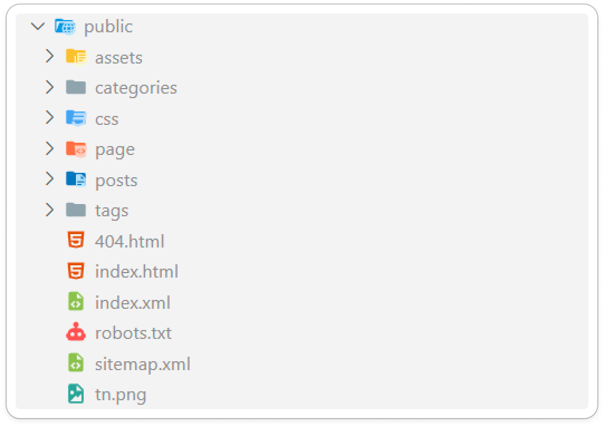
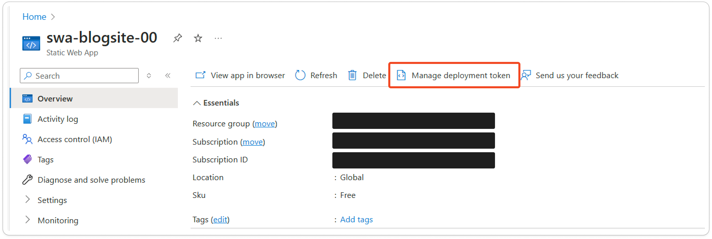

# Building a Blog & Profile Site - Let's build a Hugo-Site! (2/2)

So last time, we looked at the steps that I took to where we are today.
This time, we will look on the solution that I am using for my blog & profile site!

I hope you are ready because it is one heck of a journey!

## Let's look at Hugo

Well, Hugo is a static site generator, built in the Go-language.
It uses the famous Go-template and is able to generate the HTML pages based on Markdown input files.
It is also able to build reusable components like shortcodes, partials and layouts.

Let's start off with the latter one: Layouts.
Layout is mainly for visualizing the content. If you need a list, or want to visualize a single item - all of that does exist.
The theme I've used does give a couple of built-in layouts, which are modified to fit more my needs.

These layouts are built up using Partials, which, like the name says, are parts that we want to reuse, but not like HTML tags. Consider it to be like a more larger composed component in Angular.
These partials are components like the footer, header or cover. They know how to render that specific component.
Shortcodes on the other hand are more like a core component, think components like a button, a link,... .
As mentioned earlier, Hugo uses Go Templates. It is really a powerful templating engine, while staying light.

## It's more than just code

And that is true! Besides the template powers that Hugo offers, we need also to think of the writing and DevOps side of things. I mean come on, it is still a blog site :shrug:.

Writing posts is very easy: go to the Content folder > posts > create a new folder with the slug as the name and in there create an index.md file!


The reason why one would use a folder over the md file only, is that you are able to bundle images for a specific post in a folder structure that makes life easier!

The writing part, I mainly do in VS Code! Markdown support is sublime (little joke on the side) there!
I also installed the plugin Front Matter CMS - A little CMS running inside your VS Code! It enables additional features, such as copy paste images in markdown, and also has a handy overview where one can see all posts without glancing through the folder structure.


Front Matter CMS also integrates into my Hugo project and understands where I want media to be stored.
Further it manages the metadata section of my markdown file and also gives some handy overview of my page.
.

If I need a preview of my content, I simply hit

```bash
hugo server
```

into my VS Code terminal and I get a local version of the app running!

When I am happy with a change, I firstly push it to GitHub (so I can access it from everywhere) and review it a couple of times before pushing it out to the wide world!

## Let's get it up and running!

So, we've talked about the whole writing part, let’s see how the DevOps works - shall we?
I use an Azure Static website (free) for hosting! It gives everything I need as I don't have any server side requirements.

To build the website it is simply this command:

```sh
hugo
```

Simple, easy - that's what I like!
This creates the static files and spits them out in the `public` folder:


So... Once the build is done, you can publish it right?
Well not 100% - You need to tell Hugo where it is being hosted so it can set the paths to the resource correctly.
You can do that by adding the --base-url argument:

```sh
hugo --baseURL https://www.kirschhock.com/
```

This sets all paths correct that it can be hosted on that website.

And Now, we are ready to publish!
Azure Static Website offers a CLI tool, (which you can find here: [static-web-apps-cli](https://learn.microsoft.com/en-us/azure/static-web-apps/static-web-apps-cli-install) ) that can help you with that. Heck, it even can build you app if you want.
I did experiment a bit with the latter, but thanks to the easy `hugo` command, I didn't deem it as an absolute must.

To publish the site, initially I need to give the Azure portal a quick visit, to find the right deployment token.
On a Static site you can find it right here:


Next up, is triggering the deployment with the following command:

```sh
swa deploy .\public --deployment-token [TOKEN HERE]
```

By default, the previous command will deploy it on the preview environment. This you can see as a staging slot.
It is very handy for me, if I want to verify that everything is working and looks correctly.
Once I have verified the website, I can go ahead and deploy it to the production environment.:

```sh
swa deploy .\public --env production --deployment-token [TOKEN HERE]
```

And there you have it! One Hugo site deployed in Azure!

## What's in for it in the future

I might look into how I can leverage an Angular or Svelte site on a Static web app, which could become a new journey you can take with me down in the future!
But for now I stick with this setup: it offers everything I need at a very cost effective way. It is simple and easy for me to tinker in.
Maybe the whole partials and shortcodes can be a bit daunting at first. But once you got the hang of it - I would dare to say that it is easier than ASP.NET Razor even.

Anyways that'll be it for today - Don't forget to C# too! 👋
