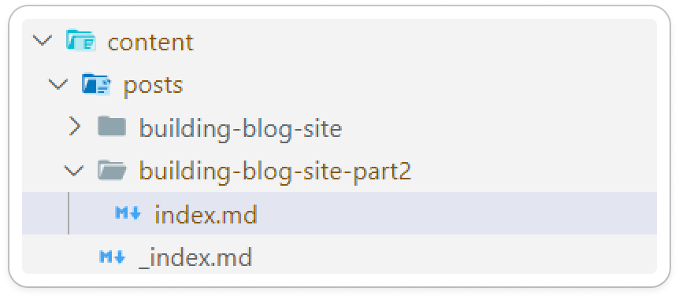
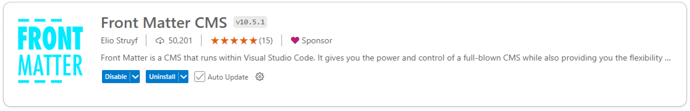
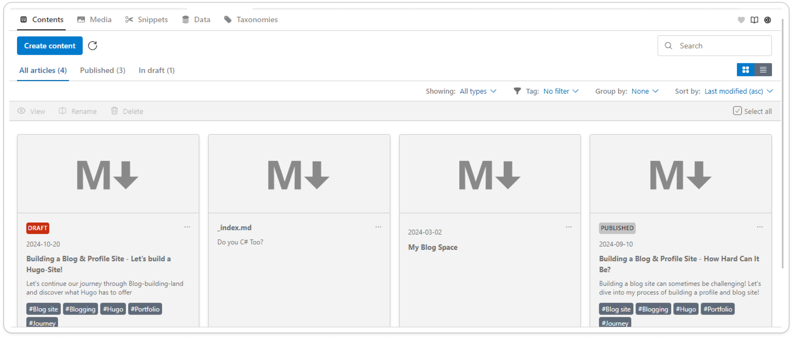
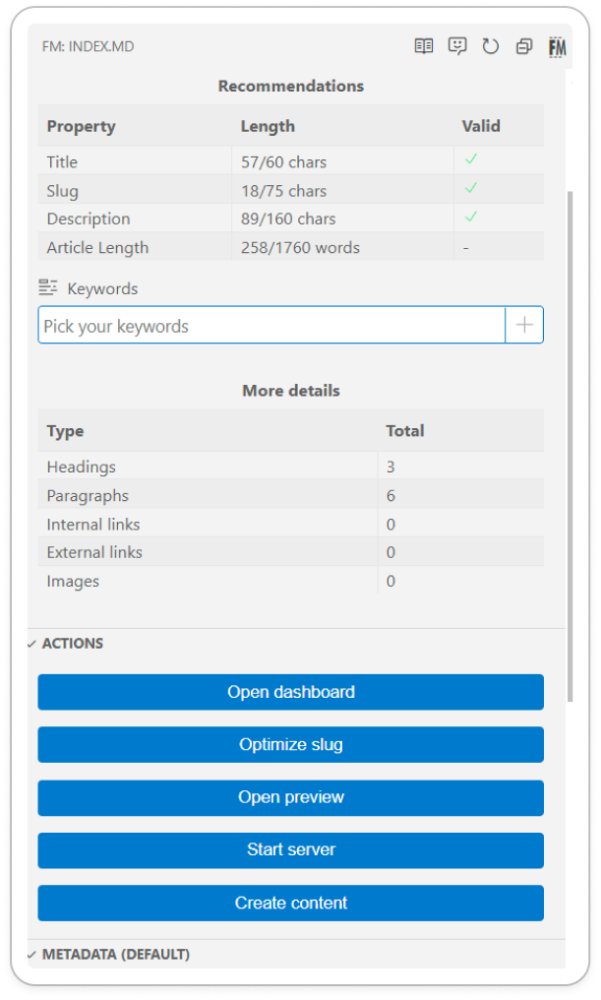

# Building a Blog & Profile Site - Let's build a Hugo-Site! (2/2)

So last time, we looked at the steps that I took to where we are today.
This time, we will look on the solution that I am using for my blog & profile site!

I hope you are ready cause it one heck of a journey!

## Let's look at Hugo

Well, Hugo is a Static site generator, built in the Go Language.
It uses the famous Go Template and is able to generate the HTML pages based of the Markdown.
It is also able to build reusable components like Shortcodes, partials and layouts.

Let's start of with the most obviousle: Layouts.
Layout is mainly for visualizing the content. If you need a list, or want to visual a single item - all of that does exists.
The theme I've used does give a couple of built-in layouts, which are modified to fit more my use.

These layouts are built up using Partials, which are, like the name says, are parts that we want to reuse, but not like html tags. More a larger composed component.
These partials are components like the footer, header or cover. They know how to render that specific component.
Shortcodes on the other hand are more like a core component, example a button, a link,... .
As mentioned earlier, Hugo uses Go Templates. It is realy a powerfull templating engine, while staying light.

## It's more than just code

And that is true! Besides the template powers that Hugo offers, we need also to think of the writing and DevOps side of things. I mean come on, it is still a blog site :shrug:.

Writing posts is very easy: Goto the Content folder > posts > create a new folder with the slug as the name and in there create an index.md file!


The reason why one would use a folder over the md file only, is that you are able to bundle images for a specific post in a folder structure that makes life easier!

The writing part, I mainly do in VS Code! Markdown support is sublime (little joke on the side) there!
I also installed the plugin Front Matter CMS - A little CMS running inside your VS Code! It enables additional features, such as copy paste images in markdown, and also has a handy overview where one can see all posts without glancing through the folder structure.


Front Matter CMS also integrates into my Hugo project and understands where I want media to be stored.
Further it manages the metadata section of my markdown file and also gives some hany overview of my page.
.

If I need a preview of my content, I simply hit

```bash
hugo server
```

into my vs code terminal and I got a local version of the app running!

When I am happy with a change, I firstly push it to GitHub (so I can access it from everywhere) and review it a couple of times before pushing it out to the wide world!

## Let's get it up and running!

So, we've talked about the whole writing part, lets see how the Devops works - shall we?
I use an Azure Static website (free) for hosting! It gives everything I need as I don't have any server side requirements.

// Talk about building
// Talk about publishing

## What's in for it in the future

For now I stick with this tooling! It offers everything I need at a very cost effective way!
// Maybe we need to change?
