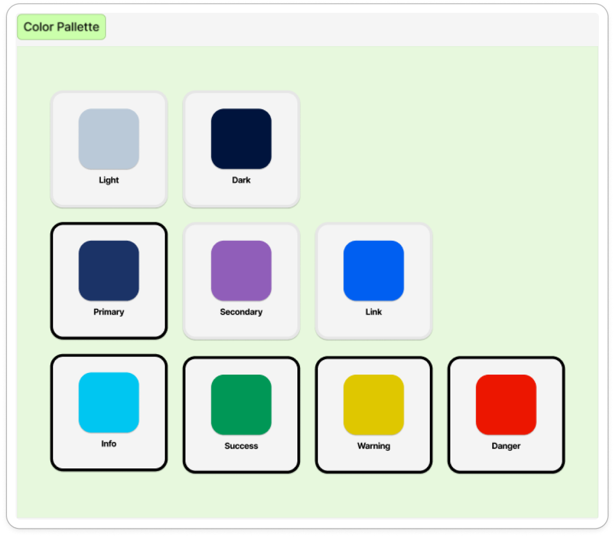
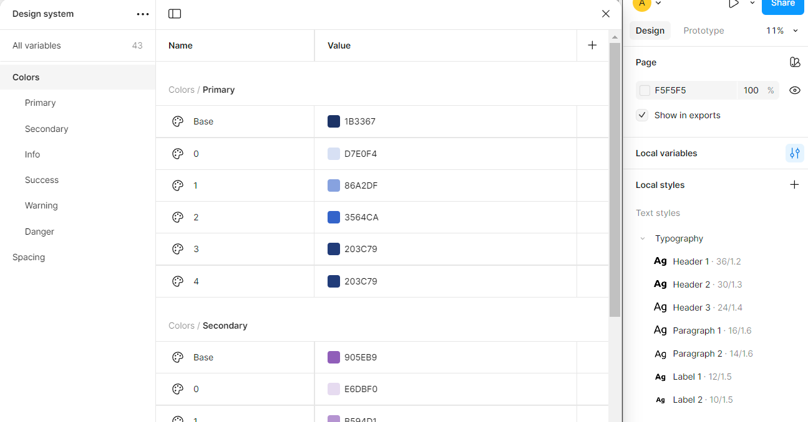

# Translate design tokens to SCSS tokens

Let's begin in understanding where the need came from.
While working on the Skillerjobs project, we figured out that there is a need to be able to export the variables in Figma to CSS variables and SCSS variables, so they could, for example, be plugged in the Angular Material Theme of our app.

## Where it begins.

Everything begins somewhere. And in this story, it begins in the variables that our designer created in Figma. It is an mixture between Typography variables, color variables and spacing variables.

Let's rebuild it from scratch.
Firstly, we need to define our base colours. We can use these colours to determin the hue values of them and create the pallette.

Do note, for sake of this post, I kept the pallete rather simple. The concept stays the same though.

For purpose of this post, I made a small example of how it looks like for our app.
