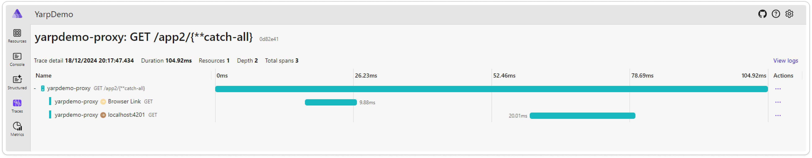

## The situation

Let's firstly see the what the current situation is:
Assume we have two (frontend) apps that are hosted under the same domain, let's call it `mydomain.app`.
App one can be found under - let's say `mydomain.app/app1`, and app two can be found at `mydomain.app/app2`.
Lastly, if you don't type in any other valid path, it should redirect to app1.

Also both apps use Supabase and its authentication provider - which is awesome!

In some cases you could consider frontend federation and just create a microfrontend, but there could be two counter-arguments:

- the apps don't have anything to do with each other
- you don't have the capacity to maintain a complex architecture (e.g. private projects)

So, you grab the best reverse proxy off the shelf, like Nginx - and slap a configuration and whahm - a reverse proxy.

All was good until, I started adding social logins (Facebook, Google,...) to the Supabase auth, which made the cookies rather large...

## Then the trouble came...

Everything was fine until, I started implementing authentication which requires cookie authentication:
`NGINX 400 Bad Request: Request Header Or Cookie Too Large`
Thing is, that cookie was indeed large, containing the access token (Supabase). So reworking anything there wasn't an option.
But, after reading a bit more about how Nginx deals with reverse proxies and their buffer thing.
Naturally, I increased the buffer. But the error kept returning (e.g. other cookies that were added by various tools we use).

I knew about YARP since Microsoft published it back in 2021 and what they wanted to do with it but never got the possibility to use it in production.
But here it was! YARP's time to shine!

## YARP?

[YARP](https://github.com/microsoft/reverse-proxy) stands short for _Yet Another Reverse Proxy_ and was build by Microsoft for internal projects, which needed a (reverse) proxy for their services.
It is also very easy to use! Far easier than Nginx in Docker, if you ask me!
You simply set up a basic ASP.NET Core project, add the YARP nuget and add the configuration, which can be done both using JSON or in-code.

## The project

The project is really simple blank Asp.Net App with a single `Program.cs`.
To get the proxy up and running, I added the following Nuget: `Yarp.ReverseProxy`.

In this example I will show how to configure the proxy in code. But the [YARP documentation page](https://microsoft.github.io/reverse-proxy/articles/index.html), does realy explain very well how to configure it purely in JSON-config as well.

```cs
using Yarp.ReverseProxy.Configuration;

var builder = WebApplication.CreateBuilder(args);

builder.Services.AddReverseProxy()
    .LoadFromMemory(new[]
    {
        new RouteConfig
        {
            RouteId = "app1_route",
            ClusterId = "app1_cluster",
            Match = new RouteMatch
            {
                Path = "/app1/{**catch-all}"
            }
        }

        ,
        new RouteConfig
        {
            RouteId = "app2_route",
            ClusterId = "app2_cluster",
            Match = new RouteMatch
            {
                Path = "/app2/{**catch-all}"
            }
        }
    },
    new[]
    {
        new ClusterConfig
        {
            ClusterId = "app1_cluster",
            Destinations = new Dictionary<string, DestinationConfig>
            {
            {
                    "destination1",
                    new DestinationConfig {
                        Address =  "http://localhost:4200"
                    }
                }
            }
        },
        new ClusterConfig
        {
            ClusterId = "app2_cluster",
            Destinations = new Dictionary<string, DestinationConfig>
            {
                {
                    "destination1",
                    new DestinationConfig {
                        Address = "http://localhost:4201"
                    }
                }
            }
        }
    });
var app = builder.Build();
app.MapReverseProxy();
app.MapGet("/", () => Results.Redirect("/app2", permanent: true));

app.Run();
```

That's it! It does exactly the same as the nginx proxy, just doesnt have the pesky buffer errors.
It is even better! You can include it in your Aspire (backend) project, include your service defaults, and it also traces proxy-requests in the aspire dashboard - perfectly to trace errors:


Well that's all that I got prepared for today! You can check all the related Source code at the GitHub Repository.

Keep posted for more articles and... - Don't forget to C# too! 👋
